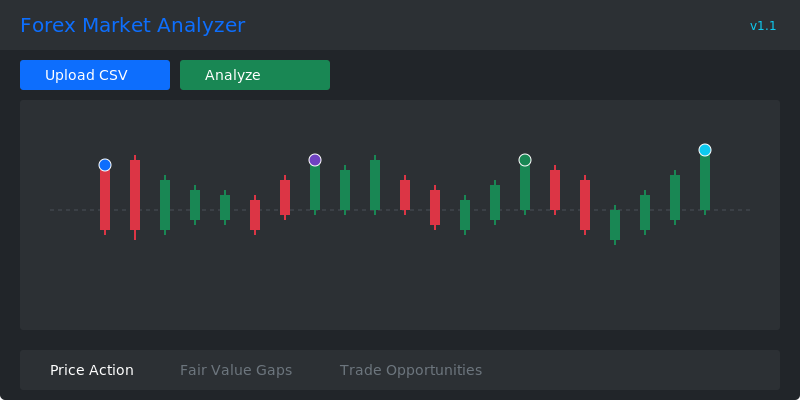

# Market Analyzer: Forex Trading Analysis Tool

A web application for forex market analysis that helps traders identify price action patterns, Fair Value Gaps (FVGs), and potential trading opportunities through advanced data processing and visualization.



## Features

- Upload and process forex candle data from CSV files
- Automatically generate higher timeframe candles (5m, 15m, 30m, 1H, 4H)
- Identify and validate price action patterns (HH, HL, LH, LL, BOS, CHoCH)
- Detect Fair Value Gaps and calculate fill percentages
- Find trade opportunities based on CHoCH patterns and FVGs
- Track trade statistics with 1:2 risk-reward ratio
- Interactive chart visualization with LightweightCharts
- Dark theme UI with Bootstrap

## Key Technologies

- Backend: Python/Flask
- Database: PostgreSQL (default), MySQL (configurable)
- Frontend: JavaScript with LightweightCharts
- UI: Bootstrap CSS

## Installation

1. Clone the repository
2. Install required dependencies:
   ```
   pip install -r requirements.txt
   ```
3. Configure environment variables (see Configuration section)
4. Initialize the database:
   ```
   python init/db_init.py
   ```
5. Run the application:
   ```
   python main.py
   ```

## Configuration

The application can be configured using environment variables:

- `DB_TYPE`: Database type to use ('postgresql' or 'mysql', default: 'postgresql')
- `DATABASE_URL`: PostgreSQL connection URL (used when DB_TYPE=postgresql)
- `MYSQL_HOST`: MySQL host (default: 'localhost')
- `MYSQL_PORT`: MySQL port (default: 3306)
- `MYSQL_USER`: MySQL username
- `MYSQL_PASSWORD`: MySQL password
- `MYSQL_DATABASE`: MySQL database name
- `SESSION_SECRET`: Secret key for Flask sessions

For more detailed database configuration options, see [Database Configuration Guide](docs/database_config.md).

Create a `.env` file in the root directory with these variables.

## Database Structure

The application uses a relational database with the following main tables:

1. **Candles**: Stores price candle data across all timeframes
2. **PriceActionPatterns**: Stores identified price patterns linked to candles
3. **FairValueGaps**: Stores FVGs identified in the market
4. **TradeOpportunities**: Stores potential trade setups based on patterns and FVGs

The application uses a hierarchical candle model to represent different timeframes:
- 1m candles link to 5m candles
- 5m candles link to 15m candles
- 15m candles link to 30m candles
- 30m candles link to 1H candles
- 1H candles link to 4H candles

This is implemented through parent-child relationships using foreign keys.

## Price Action Patterns

The analyzer identifies the following price action patterns:

- **HH (Higher High)**: A peak that's higher than the previous peak
- **HL (Higher Low)**: A trough that's higher than the previous trough
- **LH (Lower High)**: A peak that's lower than the previous peak
- **LL (Lower Low)**: A trough that's lower than the previous trough
- **BOS (Break of Structure)**: When price breaks above a previous high or below a previous low
- **CHoCH (Change of Character)**: A pattern that indicates a potential change in trend direction

## Fair Value Gaps (FVGs)

FVGs are areas on the chart where price has moved so quickly that it has left a gap. Types of FVGs:

- **Bullish FVG**: When the low of a candle is higher than the high of the candle two bars later
- **Bearish FVG**: When the high of a candle is lower than the low of the candle two bars later

## Usage

1. Start the application
2. Upload a CSV file with 1-minute forex data
3. The system will automatically generate higher timeframe candles
4. Use the "Link Timeframes" button if candles aren't properly linked
5. Analyze price action patterns using the Price Action tab
6. Identify Fair Value Gaps using the FVG tab
7. Find trading opportunities in the Trade Opportunities tab

## Data Format

The CSV file should contain the following columns:
- timestamp: Date and time (in a format parseable by pandas)
- open: Opening price
- high: High price
- low: Low price
- close: Closing price
- volume: Volume

Example:
```
timestamp,open,high,low,close,volume
2025-03-15 12:00:00,1.1234,1.1241,1.1232,1.1238,86
2025-03-15 12:01:00,1.1238,1.1245,1.1237,1.1243,93
```

## Trade Opportunities

The system identifies trade opportunities based on:
1. CHoCH patterns on a higher timeframe (typically 15m)
2. FVG on a lower timeframe
3. Entry price at the FVG level
4. Stop loss based on recent price action
5. Take profit with a 1:2 risk-reward ratio

## Development

To run the application in development mode:
```
flask run --host=0.0.0.0 --port=5000 --debug
```

Or simply:
```
python main.py
```

## API Endpoints

The application provides the following API endpoints:

- `POST /api/upload`: Upload and process CSV data
- `GET /api/candles`: Get candles for a specific symbol and timeframe
- `GET /api/timeframes`: Get available timeframes for a symbol
- `POST /api/analyze/price-action`: Analyze price action patterns
- `POST /api/analyze/fvg`: Analyze Fair Value Gaps
- `POST /api/analyze/opportunities`: Find trade opportunities
- `GET /api/statistics`: Get trade statistics
- `GET /api/patterns`: Get price action patterns
- `GET /api/fvgs`: Get Fair Value Gaps
- `GET /api/opportunities`: Get trade opportunities
- `POST /api/link-timeframes`: Link candles across timeframes

## License

MIT